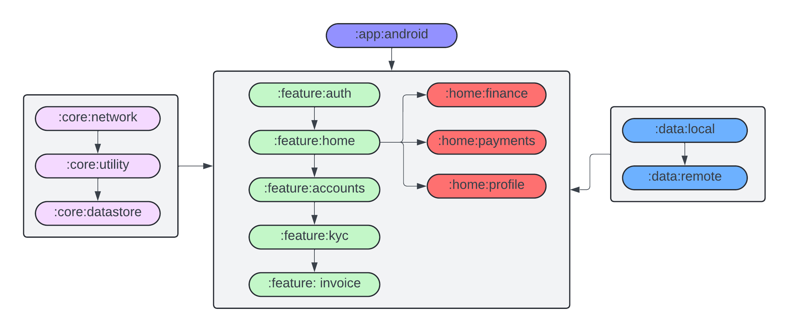

<p align='center'>
    
    <br><br><br>
    
    <br><br>
    <center><h1>GSoC'24 PROPOSAL - The Mifos Initiative</h1></center>
    <center><h2><b>Functional Enhancements to Mobile Wallet for G2P Use Cases
</b></h2></center>
    <br><br><br>
</p>

Organization: [Mifos Initiative](https://mifos.org/)

Project Name: [Functional Enhancements to Mobile Wallet for G2P Use Cases](https://mifosforge.jira.com/wiki/spaces/RES/pages/3532095546/Google+Summer+of+Code+2024+Ideas#Functional-Enhancements-to-Mobile-Wallet-for-G2P-Use-Cases)

Candidate Name: [Pratyush Singh](https://github.com/PratyushSingh07)

Expected Project Size: 350 hours

Mentors: 
- [Rajan Maurya](https://github.com/therajanmaurya) 
- [Avinash Vijayvargiya](https://github.com/avivijay19)

<br><br><br><br><br><br><br><br>

# Contents     
1. [Project Idea](#1-project-idea)
2.  [Implementation Details](#2-implementation-details)   
    2.1  [Integrate latest version of Payment Hub EE](#21-integrate-latest-version-of-payment-hub-ee)<br>
    2.2  [Integrate Mifos' notifications framework](#22-integrate-mifos-notifications-framework)<br>
    2.3  [Incorporate  Mifos' new design library](#23-incorporate-mifos-new-design-library)  <br>
    2.4  [Migrate xml to Jetpack compose](#24-migrate-xml-to-jetpack-compose)<br>
    2.5  [Basic implementation of multi-platform](#25-basic-implementation-of-multi-platform)<br>
    2.6  [Implemented Playstore release github action pipeline](#26-implement-playstore-release-github-action-pipeline)<br>
    2.7 [Update wallet framework to be make use of Mifos' Android SDK](#27-update-wallet-framework-to-be-make-use-of-mifos-android-sdk)<br>
    2.8 [Complete migration of Java code to Kotlin](#28-complete-migration-of-java-code-to-kotlin)<br>
    2.9 [Improving the security framework](#29-improving-the-security-framework)<br>
    2.10 [Exploring PoC Architecture for Open Wallet Foundation Alignment](#210-exploring-poc-architecture-for-open-wallet-foundation-alignment)<br>
3. [Contributions To Mifos](#3-contributions-to-mifos)<br>
4. [Week Wise Breakdown](#4-week-wise-breakdown)<br>
    4.1  [Community Bonding Period (4 May - 28 May)](#41-community-bonding-period-4-may---28-may)<br>
    4.2  [Phase 1 (29 May - 9 July)](#42-phase-1-29-may---9-july)<br>
    4.3  [Phase 2 (14 July - 21 Aug)](#43-phase-2-14-july---21-aug)<br>
    4.4 [Post phase 2 (After Aug 28)](#44-post-phase-2-after-aug-28)
5.  [Why Am I The Right Person](#5-why-am-i-the-right-person)
6.  [Current Area of Study](#6-current-area-of-study)
7.  [Contact Information](#7-contact-information)
8.  [Career Goals](#8-career-goals)
9.  [My Projects](#9-my-projects)
10.  [Gitter Channel](#10-gitter-channel)
11.  [Other Open Source Contributions](#11-other-open-source-contributions)
12.  [Experience with Angular/Java/Spring/Hibernate/MySQL/Android](#12-experience-with-angularjavaspringhibernatemysqlandroid)
13.  [Other Commitments](#13-other-commitments)
14.  [What motivates me to work with mifos](#14-what-motivates-me-to-work-with-mifos-for-gsoc)
15.  [Previous Participation in GSoc](#15-previous-participation-in-gsoc)
16.  [Application to multiple Orgs](#16-application-to-multiple-orgs)
<br><br><br><br><br><br><br>


# **1. Project Idea**

Abstract
- 

- The project focuses on the enhancement and refinement of a feature-rich and secure Mobile Wallet application tailored for Government to Person (G2P) payments, demonstrating a potent tool for fintechs and financial institutions. Originating as a Google Summer of Code initiative from 2017-2023, the project delivered the initial mobile wallet framework, evolving into a sophisticated reference application with two primary apps: PixieCollect and MifosPay, later consolidating focus on MifosPay. The developmental trajectory of the project saw significant milestones: integration with Mojaloop transaction flows, user experience enhancements, support for Kotlin, and implementation of standing instructions and merchant transactions. 

- Further advancements include integration with Fineract CN, multi-theme support, migration to Kotlin, and a transition towards a multiplatform approach using Kotlin multi-platform. The project aims, in 2024, to finalize G2P functionalities, ensuring production-readiness, improving security, and adopting modern development practices such as Jetpack Compose and leveraging Mifos' Android SDK. It underscores a commitment to evolving into a generic wallet management system through the Mifos X framework, incorporating cutting-edge features like the latest Payment Hub EE version, a new notifications framework, and a redesigned architecture to align with the Open Wallet Foundation's principles. This ambitious endeavor promises to redefine the landscape of mobile wallets, emphasizing security, extensibility, and a seamless user experience for G2P payments and beyond.
<br>

# **2. Implementation Details**

## **2.1 Integrate latest version of Payment Hub EE**
- Payment Hub EE is a gateway and integration layer enabling financial institutions (DFSPs) to seamlessly connect to external payment systems and operational control center to manage and monitor the transactions flowing through these systems. Payment Hub EE supports **Mobile Money & Merchant payments**, **Bulk Payments & G2P**, **Open Banking** among other digital payment use cases

- The Payment Hub EE abstracts out the complexity of connecting directly to the APIs of an external payment system and provides a scalable and sophisticated orchestration layer powered by Zeebe to elegantly route payments and transactions across various microservices and APIs facilitating the flow of transactions amongst the core banking system, channel applications, and external payment systems. 

- To integrate this in our current setup we may have to replace the existing APIs with the payment hub apis that are listed [here](https://app.swaggerhub.com/apis/myapi943/payment-hub_ap_is/1.0#/PartyIdInfo). Moreover, we also need to satisfy our G2P use cases and apis related to those can be found [here](https://app.swaggerhub.com/apis/rrkas/open-g_2_p_erp/1.0). Currently the latest version of Payment Hub is **v1.13.0** with G2P Sandbox chart v1.5.0 which was released on 24th March 2024.

- By the time of implementation of this idea there may be changes in the version and I will adopt to those changes accordingly in consultation with my mentor. Since we will be dealing with real time  data such as transfers and other transaction we may need to implement sockets in such scenario. This is only a hypothesis and I believe to gain more insight once I actually start working on this under the guidance of my mentor

- Again like last year if we have a session on payment hub then it will help me in understanding the use cases a lot better and thus improve the way in which I integrate this in my app

## **2.2 Integrate Mifos' notifications framework**
- The current notification sub-system in Mifos provides a service to send notifications to a set of user. The service maps a notification message to recipient users and thus requires a list of user identifiers as parameter.At the point of notification generation, the list of users to be notified is evaluated in real time based on their organization, role and permissions

- The notification framework enables notification in fineract to work as follows: On event of a notification generation, the notification service is called with a notification message and a list of user identifiers that form the audience of the notification. For events that need sending notifications to a set of users based on the combination of their organization and role, the determination of the audience is done in real time. However, the approach is not optimum since there are multiple fetches from the datasource for the same data.

- A **topic-subscription model** is used to optimize the evaluation of audience. Topics are created for each organization and role combination. When users are added to an organization and assigned roles, they are added as subscribers to the relevant topics. Now, when a notification has to be sent to users having a particular role in an organization, the relevant topic is fetched and its subscribers are set as audience of the message

- From my research on Mifos' notification framework, I came across *Courage Angeh* who had contributed to this framework. She had documented all of her work in a gist that can be found [here](https://gist.github.com/Anh3h/ad945ffeb2064dc31f103e150879f0c6). Her report entails the 
**Use Case**, **Implementation Details** and the **Tables** that can be found in this [Google Docs](https://docs.google.com/document/d/1dBEm3S7OBQFQDmwkAygAng3s_0nGHLvXVujISNbJbsA/edit?usp=sharing)

- Based on the above research we may have to change the structure of **Notification Payload** to also accept the parameter for read/unread messages. It will look something like this : 
```kotlin
@Parcelize
data class NotificationPayload(
    var title: String,
    var body: String,
    var timestamp: String,
    var isRead: Boolean: // if notification was read
) : Parcelable

```
- We can follow this tentative approach to fulfil merchant request-to-pay:
    - When a merchant initiates a request-to-pay from the mobile app, a new record is created in the *request_to_pay* table
    - The creation of a new request-to-pay fires an event (e.g., NEW_REQUEST_TO_PAY_CREATED)
    - An event listener listening to this event generates the notification content (e.g., "You have a new payment request") and retrieves the merchant's entity id
    - The system gets the topic mapped to the merchant's entity id and *member_type* (assuming merchant has a unique member type) from the *topic* table
    - The system retrieves the subscribers to the topic from the *topic_subscriber* table using the topic id
    - For each subscriber, a notification is created and the subscriber (user) id is mapped to the created notification id, stored in the *notification_mapper* table
    - The *notification_mapper* table is queried to get a user’s notifications, which can then be sent out

- This is only an idea and will be revised in case my mentor says so. I feel once we have an api and a clear understanding of what to implement then it shouldn't take a lot of time in the front end

## **2.3 Incorporate  Mifos' new design library**
- Currently, our Android projects display a variety of user interfaces, with even individual applications experiencing inconsistencies in UI elements. To address this issue and ensure uniformity both within and across our apps, we need to develop a new design library. This will establish a consistent UI framework for all our projects.

- At the time of drafting this proposal, Mifos is utilizing an outdated version of the [Mifos UI Library](https://github.com/openMF/mifos-ui-library) that relies on XML. It's important to acknowledge that this will become obsolete once we transition our project to Compose. Currently, we are defining our reusable components within the :core:ui module of the project.

- The integration of a new UI library will be contingent upon the nature and structure of this library. Should it contain components common across all our Android projects, we could seamlessly replace the existing definitions with those provided by the library. For instance, consider a **Login Screen** that appears in all our projects. By defining this screen within our new library and deploying it, we can ensure consistent UI across all projects.

## **2.4 Migrate XML to Jetpack compose**
- Converting the project to jetpack compose is of utmost priority for this years GSoC. Currently we are using Fragment + Compose approach to migrate our project. We are designing compose UI and then setting the content in our fragments. This typically looks like the following
```kotlin
    setContent {
        AppTheme {
            ComposeScreen() 
        }
    }
```
- This method though not wrong, leads you to a code that is bloated and outside of the Compose mentality. Hence we need to start introducing the **Navigation Compose**. The way it will work in our project is that each **NavController** will be associated with a single NavHost composable. The **NavHost** would link the NavController with a navigation graph that specifies the composable destinations that we should be able to navigate between. As we navigate between composables, the content of the NavHost is automatically recomposed. Each composable destination in our navigation graph is associated with a route which is basically a String that defines the path to your composable

- We will need to define a file lets say `AppNavigation.kt` to define screen names and routes for Navigation. This would typically look like:
```kotlin
    enum class Screen {
        Screen1, // this will be HomeScreen in our project
        Screen2, // this will be PaymentsScreen in our project
        ... // other screens
    }
    sealed class NavigationItem(val route: String) {
        object Screen1 : NavigationItem(Screen.Screen1.name)
        object Screen2 : NavigationItem(Screen.Screen2.name)
        ... // other screens
    }

```
-  We then need to define **NavHost** with our screens in `AppNavHost.kt`. A demo implementation would like the following: 

```kotlin
    @Composable
    fun AppNavHost(
        modifier: Modifier = Modifier,
        navController: NavHostController,
        startDestination: String = NavigationItem.Splash.route,
        ... // other parameters
    ) {
        NavHost(
            modifier = modifier,
            navController = navController,
            startDestination = startDestination
        ) {
            composable(NavigationItem.Splash.route) {
                SplashScreen(navController)
            }
            composable(NavigationItem.Screen1.route) {
                Screen1(navController)
            }
            ... // other composables
    }
    
```

- After this is done we will call *AppNavHost* inside our `MainActivity.kt` file.This will lay the foundation for initial setup and will be crucial when we refactor the **Bottom Navigation** to compose. 

- Since we already have a lot of resusable components in our project, migrating the project to compose while integrating NavigationCompose shouldn't take a lot of time. I will communicate any UI revamp ideas with my mentor and will implement the same if he gives me a nod

## **2.5 Basic implementation of multi-platform**
- Implementing *Kotlin Multiplatform* (KMP) is another huge undertaking in this years GSoC. Once implemented, it will upgrade our native android application to a cross platform application

- Our project is currently broken down into a few modules and I believe we can break it down further based on different features. Each feature module handles its own scope of responsibility, usually covering the functionality of a single screen or a closely related group of screens. Right now we only have `:feature:auth` module and we can extend it to different such features. We can create a *database module* inside of core to find all the necessary classes for our local database

- We can be ambitious and take `:data` module out of core and treat it as a separate module. It will handle the data structure serving the feature modules in a well-separated manner.A data module can be associated with multiple feature modules to ensure that each feature module has complete access to all the necessary data.Every data module includes the necessary modules for **Koin**, module-specific data classes, and the repository interface and implementation

    

- To ensure cross platform application KMP shares the business logic between the platforms and it is of utmost importance that we migrate anything java related to kotlin. That includes migrating *SharedPreference* to **Data Store**, *Retrofit* to **Ktor**, *Hilt* to **Koin** and *DbFlow* to **SqlDelight**. We also have the option to choose between Koin & Kotlin-Injection and also between SqlDelight & Realm. The end purpose of their alternatives are the same and hence I will discuss the better alternative with my mentor before I start implementing any of them

- Until this point we have divided our project into different features and now we have to share this with the iOS platform.The iOS app can depend on one framework generated by the Kotlin Multiplatform module. When we use several modules, we will need to add an extra module depending on all of the modules we're using, called an umbrella module, and then we need to configure a framework containing all of the modules, called an umbrella framework.


- Because the native app depends only on the shared **Umbrella module** we need to allow an app to access submodules hidden under this Umbrella. All the submodules which we want to expose to the app should be added to the *shared/build.gradle.kts* script as an api dependency.Similarly we add the modules which should not be accessible from the native app, but this time we use an implementation dependency.

## **2.6 Implement Playstore release github action pipeline**
- Right now we are pushing all of our code to development. I suggest we create another branch lets call it *release* whose purpose would be to deploy product to playstore and this would ensure a proper flow of CI/CD

- **Fastlane** is the easiest way to automate beta deployments and releases for your iOS and Android apps. It handles all tedious tasks, like generating screenshots, dealing with code signing, and releasing your application. Initially we will need a *Google Play Credential file (.json)* for the Fastlane to deploy our apps and assuming that Mifos would have their own google playstore account we will easily able to generate this file

- We can declare various lanes in Fastfile which can have different behaviours or simply we can call them tasks. Lets say we have to deploy our application for the **RELEASE** track. Then our lane would look like: 
```python
default_platform(:android)

platform :android do

  desc "Deploy a beta version to the Google Play"
  lane :beta do
    gradle(task: "clean bundleRelease")
    upload_to_play_store(track: 'beta')
  end
  
end
```
- We require a **Keystore file (.jks)** for signing APK/App Bundle before publishing app to the Google Play. Once all of these are done we will create a worflow file **release.yml** that will look like the following:
```yaml
name: Deploy

on:
    ## add branches here for eg. release/beta
jobs:
    
    # add runner other jobs here

      - name: Configure Keystore
        run: |
        echo "$ANDROID_KEYSTORE_FILE" > keystore.jks.b64
        base64 -d -i keystore.jks.b64 > app/keystore.jks
        echo "storeFile=keystore.jks" >> keystore.properties
        echo "keyAlias=$KEYSTORE_KEY_ALIAS" >> keystore.properties
        echo "storePassword=$KEYSTORE_STORE_PASSWORD" >> keystore.properties
        echo "keyPassword=$KEYSTORE_KEY_PASSWORD" >> keystore.properties
        env:
        ANDROID_KEYSTORE_FILE: ${{ secrets.ANDROID_KEYSTORE_FILE }}
        KEYSTORE_KEY_ALIAS: ${{ secrets.KEYSTORE_KEY_ALIAS }}
        KEYSTORE_KEY_PASSWORD: ${{ secrets.KEYSTORE_KEY_PASSWORD }}
        KEYSTORE_STORE_PASSWORD: ${{ secrets.KEYSTORE_STORE_PASSWORD }}

      - name: Create Google Play Config file
        run : |
        echo "$PLAY_CONFIG_JSON" > play_config.json.b64
        base64 -d -i play_config.json.b64 > play_config.json
        env:
        PLAY_CONFIG_JSON: ${{ secrets.PLAY_CONFIG_JSON }}

      - name: Distribute app to Release track # Executing our release lane
        run: bundle exec fastlane release
```

- While deploying we need to keep in mind that we will have a KMP project by the time we finish it and hence we will have to modify our existing pipeline to add support for iOS part of the app as well whose runner will be *macos-latest*. Moreover since the idea is to implement **Multiplatform** and not just **Multimobile** jobs related to windows, linux will also have to be developed. A general implementation would look like this :
```yaml
jobs:
  releaseLinuxAndroidWeb:
    name: Release - Android, Linux, Web
    runs-on: ubuntu-latest

    steps:
      
      # checkout repository and JDK setup here

      - name: Grant Permission to Execute Gradle and scripts
        run: |
          chmod +x gradlew
          chmod +x buildApps.sh

      - name: Build with Gradle
        uses: gradle/gradle-build-action@v2

      - name: Build App
        run: ./buildApps.sh

      - name: Attach Android and Linux App 🚀
        uses: softprops/action-gh-release@v1
        with:
          files: |
            distributions/chakt-android.apk
            distributions/chakt-linux-x64.jar

      - name: Publish Web app 🚀
        uses: JamesIves/github-pages-deploy-action@v4.3.3
        with:
          branch: gh-pages
          folder: distributions/chakt-web
```

## **2.7 Update wallet framework to be make use of Mifos' Android SDK**
- 

## **2.8 Complete migration of Java code to Kotlin**
In the process of migrating to Kotlin, we significantly enhance our codebase by adopting Kotlin's more concise syntax, which notably reduces boilerplate code. Furthermore, Kotlin's built-in null safety and powerful features like coroutines and flows add substantial value to our development process. However, our ultimate objective is to transition our project to **Kotlin Multiplatform** (KMM). To achieve this, it's imperative that our entire codebase is converted to Kotlin. At the time of drafting this proposal, **only 1.6%** of the project remains to be migrated.
When I first started contributing to this project, a considerable portion needed to be transitioned from Java to Kotlin. Therefore, I initiated the conversion process on a package-by-package basis, systematically working towards our goal of a fully Kotlin-based codebase.

At the time of drafting this proposal the following files are still haven't been migrated to kotlin: 
- <font color="green">VerifyUser.java</font>
- <font color="green">WrapContentHeightViewPager.java</font>
- <font color="green">FetchAccounts.java</font>
- <font color="green">FetchAccountTransaction.java</font>
- <font color="green">RegisterUser.java</font>
- <font color="green">DownloadTransactionReceipt.java</font>

Although this task is not of immediate high priority, it plays a critical role in the grand scheme of our project objectives. Therefore, I plan to submit pull requests for these changes as promptly as possible. Should I encounter any challenges in completing this task before the Google Summer of Code timeframe, I am committed to resolving it before the conclusion of the first coding phase.

# **2.9 Improving the security framework**  
- 

# **2.10 Exploring PoC Architecture for Open Wallet Foundation Alignment** 
- The OWF aims to set best practices for digital wallet technology through collaboration on standards-based OSS components that issuers, wallet providers and relying parties can use to bootstrap implementations that preserve user choice, security and privacy all of which aligns with Mifos' Initiative of advancing the **Sustainable Development Goal** of **No Poverty**

- Mifos already has a small project titled [Alignment with Emerging Open Wallet Standards 
](https://mifosforge.jira.com/wiki/spaces/RES/pages/3532095546/Google+Summer+of+Code+2024+Ideas#Alignment-with-Emerging-Open-Wallet-Standards)
whose objective is to research the different open wallet standards emerging from the Open Wallet Foundation, GovStack wallet building block, and utilize other digital public goods for identity including Inji from MOSIP and the Gluu Project

- The above idea is no way different from what we have to do and hence this reseach will compliment mine in every possible way. During the GSoC I will explore the current status of the specifications, standards and design a POC architecture for mobile wallet that aligns with the standards and specifications in their current state


# **3. Contributions to Mifos**
Ever since GSoC 2023 concluded, I have kept contributing to Mifos and this contribution is not just limited to **Mobile Wallet** but also extends to **Mifos Mobile** and **Mifos Passcode**

Below are links to some of my notable contributions at the time of submitting this proposal : 

### **Merged Pull Requests** for Mobile Wallet
<ul>
1. <a href="https://github.com/openMF/mobile-wallet/pull/1591" >PR #1591: Migrated Bank Account Detail Screen to compose</a>
<br>
2. <a href="https://github.com/openMF/mobile-wallet/pull/1579" >PR #1579: Migrated Finance Screen to compose</a>
<br>
3. <a href="https://github.com/openMF/mobile-wallet/pull/1548" >PR #1548: Migrated Payments Screen to compose</a>
<br>
4. <a href="https://github.com/openMF/mobile-wallet/pull/1547" >PR #1547: Migrated Profile Screen to compose</a>
<br>
5. <a href="https://github.com/openMF/mobile-wallet/pull/1508" >PR #1508: Migrated Settings Screen to compose</a>
<br>
6. <a href="https://github.com/openMF/mobile-wallet/pull/1538" >PR #1538: Migrated FAQ Screen to compose</a>
<br>
7. <a href="https://github.com/openMF/mobile-wallet/pull/1426" >PR #1426: Migrated Login Screen to compose</a>
<br>
8. <a href="https://github.com/openMF/mobile-wallet/pull/1573" >PR #1573: Introduced Detekt for static code analysis</a>
<br>
9. <a href="https://github.com/openMF/mobile-wallet/pull/1524" >PR #1524: Rectified Github Workflow of the project</a>
<br>
10. <a href="https://github.com/openMF/mobile-wallet/pull/1526" >PR #1526: Rectified Authentication Logic of the project</a>
<br>
11. <a href="https://github.com/openMF/mobile-wallet/pull/1462" >PR #1462: Fixed app crash when selecting FAQ</a>
<br>
12. <a href="https://github.com/openMF/mobile-wallet/pull/1510" >PR #1510: API package from java to kotlin</a>
<br>
13. <a href="https://github.com/openMF/mobile-wallet/pull/1540" >PR #1540: Checkstyle for all modules</a>
<br>
</ul>

- I have a total of **36 Merged Pull Requests** in mobile wallet. You can find all of my merged PRs [here](https://github.com/openMF/mobile-wallet/pulls?page=1&q=is%3Amerged+is%3Apr+author%3APratyushSingh07)

###  **Merged Pull Requests** for Mifos Mobile
<ul>
1. <a href="https://github.com/openMF/mifos-mobile/pull/2436" >PR #2436: Migrated Login Screen to compose</a>
<br>
2. <a href="https://github.com/openMF/mifos-mobile/pull/2456" >PR #2456: Migrated User Profile Screen to compose</a>
<br>
3. <a href="https://github.com/openMF/mifos-mobile/pull/2459" >PR #2459: Migrated Registration Screen to compose</a>
<br>
4. <a href="https://github.com/openMF/mifos-mobile/pull/2257" >PR #2257: Migrated AboutUs Screen to compose</a>
<br>
5. <a href="https://github.com/openMF/mifos-mobile/pull/2307" >PR #2307: Fixed Unexpected Biometric Prompt</a>
<br>
6. <a href="https://github.com/openMF/mifos-mobile/pull/2499" >PR #2499: Updated endpoint for debug</a>
<br>
7. <a href="https://github.com/openMF/mifos-mobile/pull/2430" >PR #2430: Refactored Client Charges to stateflow</a>
<br>
8. <a href="https://github.com/openMF/mifos-mobile/pull/2499" >PR #2499: Update readme with current version of the project</a>
</ul>

- I have a total of **83 Merged Pull Requests** in mifos mobile alone. You can find all of my merged PRs [here](https://github.com/openMF/mifos-mobile/pulls?page=1&q=is%3Apr+is%3Amerged+author%3APratyushSingh07)

### **Open Pull Requests**
- At the time of drafting this proposal I dont have any PR across any of Mifos's project

- I intend to continue contributing to the codebase even after submitting my proposal and expect that there may be changes made to the Pull Requests that I have opened. Therefore, I am providing the links to those PRs [here](https://github.com/openMF/mobile-wallet/pulls/PratyushSingh07)

### **Issues Reported**
- I had opened a total of **15 issues** that mainly focused on bugs that were present in the codebase and also on the features that were absent from the mifos mobile at the time . Some of them are still open and have PRs either by me or from my fellow contributors 
- All of my open and closed issues can be accessed from [here](https://github.com/openMF/mobile-wallet/issues/created_by/PratyushSingh07) 

Besides contributing to the various projects, I have also dedicated my time to reviewing Pull Requests raised by my fellow contributors and helping them onboard in our open source community. Ever since last years GSoC concluded, I have been actively connected to Mifos

# **4. Week Wise Breakdown**

## **4.1 Community Bonding Period (1 May - 26 May)**

### *Week 1*
- Get in touch with the developers and the mentor
- Introduction to the community, to the mentor and fix timings to communicate
- Discuss any suggestions and changes to the project. There could modifications, new additions or amendments; it would be better to go over these early 

### *Week 2*
- Go Through Mobile Wallet codebase 
- Address issues that can be a hurdle during the GSoC
- Go through the Open Banking API and related documentations 

### *Week 3*
- Discuss the working of the existing application with the mentor 
- Go over the new design in detail and ask for changes and suggestions
- Migrate the project to kotlin 

## **4.2 Phase 1 (27 May - 12 July)**

### *Week 4*
- I will start off by picking up screens that are yet to be migrated to **compose**
- In the process, I shall remove fragments and handle navigation with compose itself
- I am already contributing to this task and I assume we can be done within a week

### *Week 5*
- Before moving to KMP, I would like to integrate **Mifos's Android SDK**
- Right now the SDK uses retrofit so we wont be able to use it in our shared module
- If we go with this then we will have to create an abstraction over it, and provide the native/iOS implementation 

### *Week 6*

- I will start off with **KMP** implementation in this week
- Will make use of umbrella module so that iOS can also share the business logic 
- Migrate from retrofit to ktor & also from Hilt to Koin

### *Week 7*
- Migrate from DbFlow to SqlDelight
- Optionally migrate from SharedPreference to DataStore 
- Start writing UI for iOS part

### *Week 8 and Rest of Phase 1*

- *Buffer* for any pending tasks
- Prepare a report for evaluation
- Discuss brief plan for Phase 2 with the mentors

## **4.3 Phase 2 (12 July - 26 Aug)**

### *Week 10*
- Integrate Mifos's **Notification Framework** based on my research
- Last year we had sessions on PaymentHub and if something similar happens this year then it will be beneficial
- Connect with backend team to understand the requirement

### *Week 11*
- Integrate latest version of **Payment Hub** in mobile wallet project
- I will consult with my mentor the API endpoints that needs to be hit for transactions, registrations, identification and so on before I start with the integration
- All of this will be done keeping in mind our use cases for G2P

### *Week 12*
- I will research as to how I can improve the existing **security framework** of our project
- Being a banking application I know the risks it possess and I will discuss with my mentor before I start working on this project
- Discuss about **Open Wallet Foundation** with my mentor and how our existing application fits in this movement

### *Week 13* 
- Assuming that by the end of this year's GSoC we have published our **UI library** then we can start using them in the android section of our project
- Create a Playstore release github action pipeline with jobs to check the iOS part of our app

### *Week 14 and Rest of Phase 2*

- *Buffer* to complete any remaining tasks
- Prepare report for evaluation


## **4.4 Post Phase 2 (After Aug 26)**
- Discuss the project's outcome with my mentors and devise a plan of action for future contributions
- Engage with members of the community to solicit feedback on project implementation and to identify possible add-on features


# **5. Why am I the right person ?**
I have been doing Android Application Development for more than two year now. I have gained
proficiency in it by doing multiple Internships, several Open Source Contributions as well as
Hackathons.I am quite conversant with Android Architectural Components, MVVM, jetpack compose, support libraries, version control, Networking Services, Firebase, Dependency Injection etc

Moreover, I had contributed to Mifos last year as well and successfully completed the project that I was assigned. Furthermore, I am now accustomed to the mobile wallet project since I have been contributing to it for the last 3 months

# **6. Current area of study**
I am pre final year student pursuing **Information Science and Engineering** at Dayananda Sagar College of Engineering.
- Over the course my area of study have included :
    - Learning the fundamentals of Java, Python and C++ along with Data Structures and Computer Architecture
    - Collecting, Storing and Analyzing data using tools like SQL and Python
    - Learning about the fundamentals of ML that included supervised and unsupervised learning,neural networks and deep learning
    - Learning about distributed systems, cloud computing, and virtualization technologies.

# **7. Contact Information**
**Name**: Pratyush Singh

**Email**: <aries.pratyush@gmail.com>

**LinkedIn**: [https://www.linkedin.com/in/Pratyush-Singh/](https://www.linkedin.com/in/pratyush-singh-9323ab20a/)

**GitHub**: [https://github.com/PratyushSingh07](https://github.com/PratyushSingh07)

**Gitter Id**: [Pratyush Singh](@pratyushsingh07-63388c746da03739849d52a7:gitter.im)

**Mobile Number**: +91 9693565684

**Time Zone**:  Indian Standard Time (GMT+5:30)
<br>

# **8. Career Goals**
As an android developer my first and foremost goal is to master the Android SDK,Multithreading and other related technologies and create a portfolio of projects that would include personal projects, open source contributions, or projects done as part of my studies or work.
As I gain more experience , I would want to specialize in UI/UX design along with enterprise app development and seek out for leadership roles. 
I would sooner or later venture into AOSP and get a grasp of low level android as well and transition into a full stack mobile developer.
I am self taught like many other developers out there and Open Source Projects have played an integral part in my growth and thus I would give back to this android community by sharing my knowledge and expertise through blog posts, tutorials,speaking engagements and of course by contributing to Open Source Projects.
<!-- <br><br><br> -->

# **9. My Projects**

<b>1. CardSwipeLibrary: </b><a href="https://github.com/PratyushSingh07/BumbleCardSwipe/"><i> Source Code</i></a></br>
- Streamlined the development process for mobile applications by providing a ready-to-use library, reducing the time and
 effort required for implementing complex swipe gestures from scratch
- Empowered developers to create dynamic and interactive UI elements effortlessly, fostering innovation and creativity in
 mobile app design and development
- This Library was built entirely in compose and is also the very first library that I published

<b>2. Cyclofit: </b><a href="https://github.com/PratyushSingh07/cyclofit"><i>Source Code</i></a><br>
- Cyclofit is a safety and health monitoring system for cyclists
- It tracks the heart rate,calories burnt, distance covered and much more using the sensors integrated in a single
device.Our device has a proximity sensor that can track any incoming vehicle by monitoring it’s rate of change of speed.
The data such as the heart rate are displayed into the app through an api
- Worked with firestore , firebase , Coroutines created a community section in this app that implements a real time
database
-  Visualized data in form of graphs using <a href="https://github.com/PhilJay/MPAndroidChart">MPAndroidChart</a>
<br>

<b>3. NewsLive: </b><a href="https://github.com/PratyushSingh07/NewsApp"><i>Source Code</i></a><br>
- Developed an Android application using the NewsAPI.org API, Retrofit, MVVM architecture, Room database, and Coroutines. 
- Implemented background tasks and asynchronous operations using Coroutines, ensuring smooth app performance and user engagement.
- Integrated Room database to provide offline caching and storage of user preferences and data, reducing server requests and improving app speed and reliability
- Utilized MVVM architecture to separate concerns and increase code maintainability, as well as Retrofit to easily connect to the NewsAPI.org API and retrieve real-time news data.
<br>

# **10. Gitter Channel** 
Yes, I have visited all of mifos's gitter channel and my id was <a href="(@pratyushsingh07-63388c746da03739849d52a7:gitter.im)">PratyushSingh07</a>
<!-- <br><br><br> -->

# **11. Other Open Source Contributions** 
I have been contributing to Open Source for quite some time and here are some of my contributions:
<br>

1. Dare2Change : 
    - It's an all in one android application to enhance your productivity and I got to work on this as a part of SLoP 2022
    - Revamped the complete UI of the application and introduced a dark mode theme 
    - My contributions for Dare2Change: [check here](https://github.com/coder2699/Dare2Change/pulls?q=is%3Apr+author%3APratyushSingh07)
2. Anki-Android : 
    - There were certain  <font color="green">@KotlinCleanup</font> annotations in the codebase with messages such as *make data not null* and *simplify through scope functions*
    - I opened a few pull requests adhering to above mentioned messages
    - My contributions to Anki-Android : [check here](https://github.com/ankidroid/Anki-Android/pulls?q=is%3Apr+author%3APratyushSingh07+is%3Aclosed+)
3. Catroid : 
    - It is written predominantly in JAVA and hence refactoring the existing codebase to Kotlin is a vital task
    - I refactored certain files to kotlin 
    - My contributions for Catroid: [check here](https://github.com/Catrobat/Catroid/pulls/PratyushSingh07)

# **12. Experience with Angular/Java/Spring/Hibernate/MySQL/Android** 
Yes, I do have experience with Android and Java and have built projects centered around them. I have decent knowledge of MySQL and SQLite Databases.I have built a full stack application during the course of my internship by using Angular as the frontend and Spring Boot for developing RESTful APIs.
<br>

# **13. Other Commitments**
I am fully committed to enhancing the Mobile Wallet platform during the upcoming summer as I do not have any other conflicting commitments.
<br><br>

# **14. What motivates me to work with Mifos for GSoC** 
Mifos Initiative is making a significant difference in the world by providing financial inclusion to people who would otherwise be excluded from the formal financial system. This mission is truly inspiring, and being a part of it through the Google Summer of Code program is a privilege.
From a professional point of view mifos has a vibrant community of developers, volunteers, and supporters who are passionate about the mission of the organization. It's motivating to be a part of a community that is so dedicated to making a positive impact on the world.Besides
Google Summer of Code is a fantastic opportunity for students to gain real-world experience working on open-source projects. Mifos Initiative's participation in this program shows that they are committed to helping the next generation of developers like me succeed and contribute to something that would impact lives of billions around the globe.The work that we as a students do during the Google Summer of Code program can have a lasting impact on the Mifos Initiative and the people it serves. Knowing that the work you do can make a real difference in people's lives is incredibly rewarding.

Mifos Initiative's commitment to open-source software is essential for the sustainability of the financial inclusion ecosystem. By making their software freely available, they are enabling other organizations to provide financial services to underserved communities.
<br>

# **15. Previous Participation in GSoC**
Yes, I had participated in Google Summer of Code 2023 with this very organization and I would love to be a part of Mifos this year as well
<br>

# **16. Application to multiple orgs**
I will be applying only to Mobile Wallet for this years' GSoC
<br>